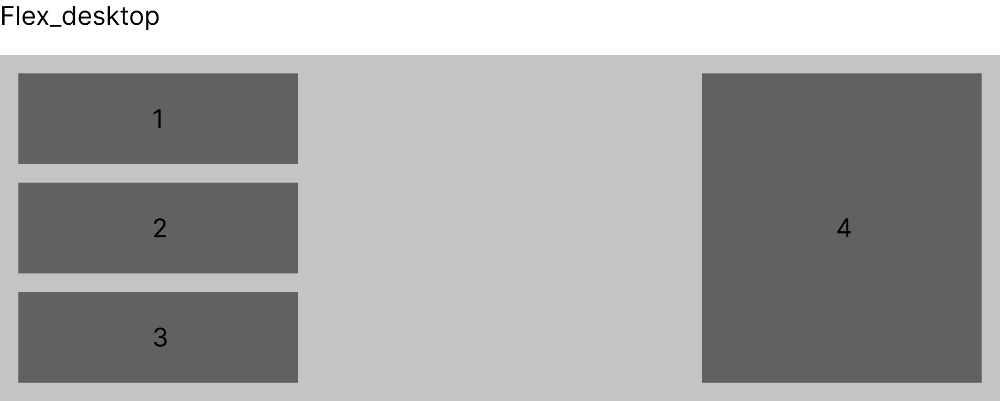
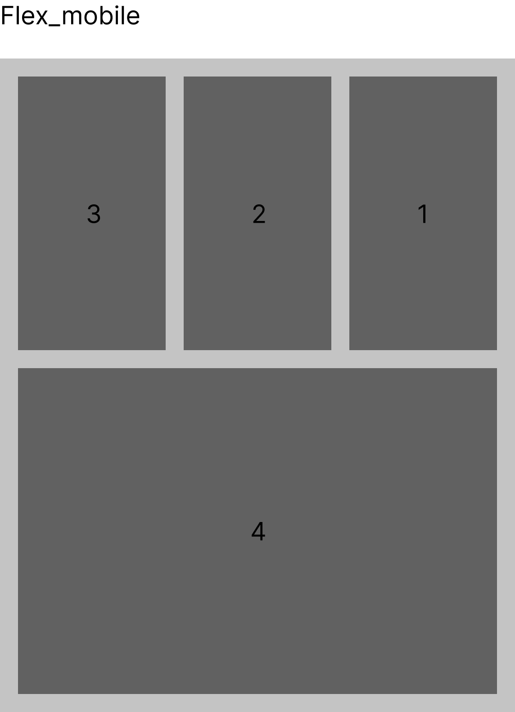
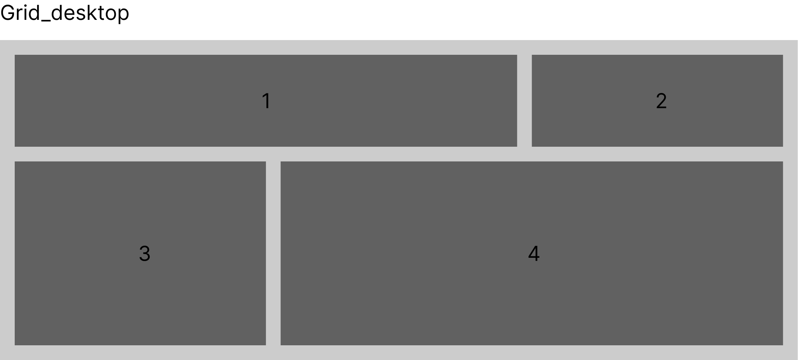
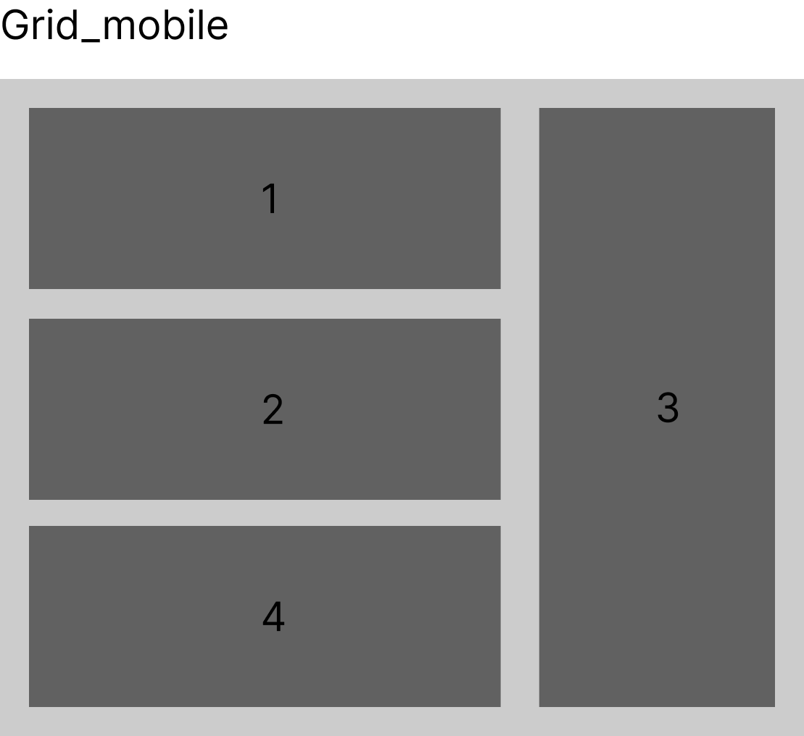

# Lenguajes de marcas: Examen 2ªEv

## Enunciado

2 Ejercicios: uno de flexbox y otro de CSS grid.

### 1. Flexbox (5pts)

Crear un div contenedor y en él, introducir cuatro elementos siguiendo las siguientes reglas:

- El contenedor ha de tener el color de fondo `#C3C3C3`, un padding de `20px` y una altura **mínima** de `350px`.

- Los elementos dentro del contenedor flexible han de tener el color `#606060` y una altura **mínima** de `50px`.

  > ⚠️ Se pueden (y se deben) usar más divs para poder agrupar los distintos elementos. Sólo aplicar la regla anterior a los elementos de color gris oscuro de las imágenes

- Utilizando la metodología **DESKTOP FIRST** y con sólo una mediaquery, realizar lo siguiente:

  - En pantallas **mayores** de `700px` disponer los elementos como en la imagen `flex_desktop`, haciendo que los 4 elementos de color gris oscuro tengan un **ancho máximo** de `300px`:

    

  - En pantallas **menores** de `700px` disponer los elementos como en la imagen `flex_mobile`, haciendo que los 4 elementos de color gris oscuro tengan un **ancho máximo** de `300px`:

    

### 2. Grid (5pts)

Crear un div contenedor y en él, introducir cuatro elementos siguiendo las siguientes reglas:

- El contenedor ha de tener el color de fondo `#C3C3C3`, un padding de `20px` y una altura **mínima** de `350px` La cuadrícula ha de ocupar siempre el `100%` del **ancho**

> ⚠️ Usar Fracciones como unidad de medida para las filas y columnas.

- Los elementos dentro del contenedor han de tener el color `#606060` y una altura **mínima** de `100px`. Los elementos han de ocupar también el `100%` del **ancho** que se les asigna en la cuadrícula

- Utilizando la metodología **MOBILE FIRST** y con sólo una mediaquery, realizar lo siguiente:

  - En pantallas **mayores** de `700px` disponer los elementos como en la imagen `grid_desktop`, donde se puede apreciar que el elemento 1 es el doble de ancho que el elemento 2 y 3. Los elementos 3 y 4 son el doble de altos que los elementos 1 y 2.

    

  - En pantallas **menores** de `700px` disponer los elementos como en la imagen `grid_mobile`, donde la columna de la izquierda es el doble de ancha que la de la derecha.

    

## Calificación

**1. Flexbox (5 pts):**

- **[1pt]** Uso apropiado de clases, ids y/o selectores
- **[1pt]** Estructura HTML correcta
- **[1pt]** En pantallas mayores de 700px se visualiza correctamente
- **[1pt]** En pantallas menores de 700px se visualiza correctamente
- **[0.5pt]** Uso correcto de las mediaqueries
- **[0.5pt]** Empleo de la metodología **desktop** first (sólo una mediaquerie es necesaria)

**2. Grid (5pts)**

- **[1pt]** Uso apropiado de clases, ids y/o selectores
- **[1pt]** Estructura HTML correcta
- **[1pt]** En pantallas mayores de 700px se visualiza correctamente
- **[1pt]** En pantallas menores de 700px se visualiza correctamente
- **[0.5pt]** Uso correcto de las mediaqueries
- **[0.5pt]** Empleo de la metodología **mobile** first (sólo una mediaquerie es necesaria)
